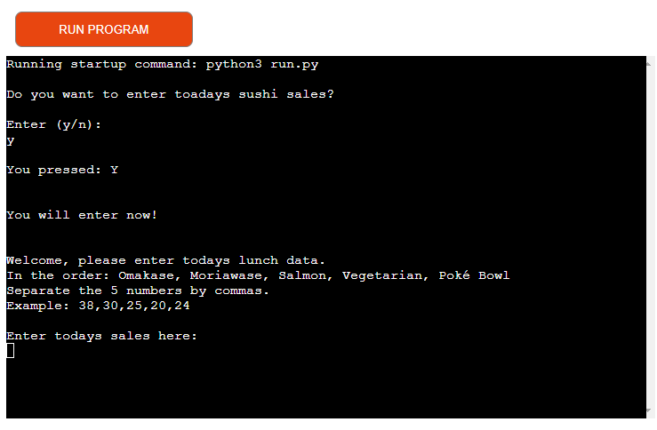
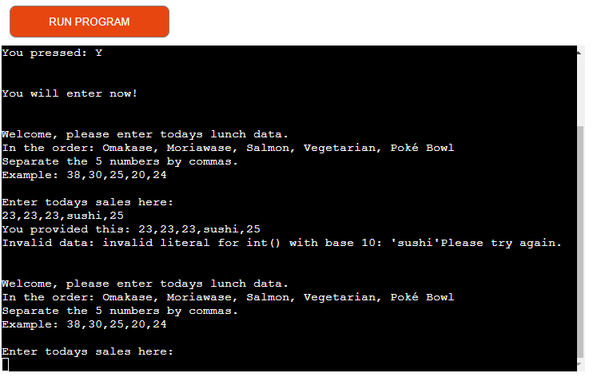
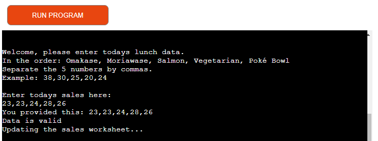
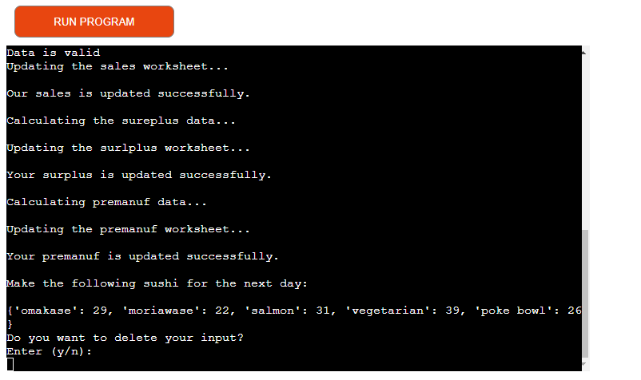
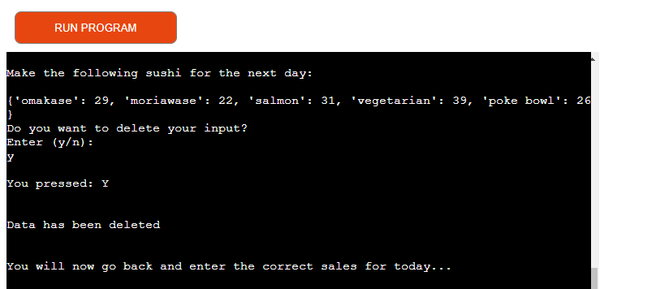
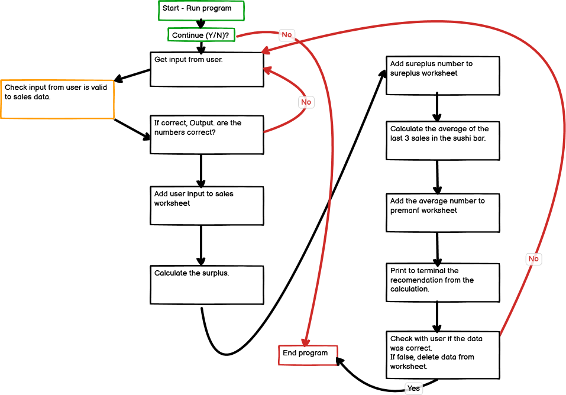
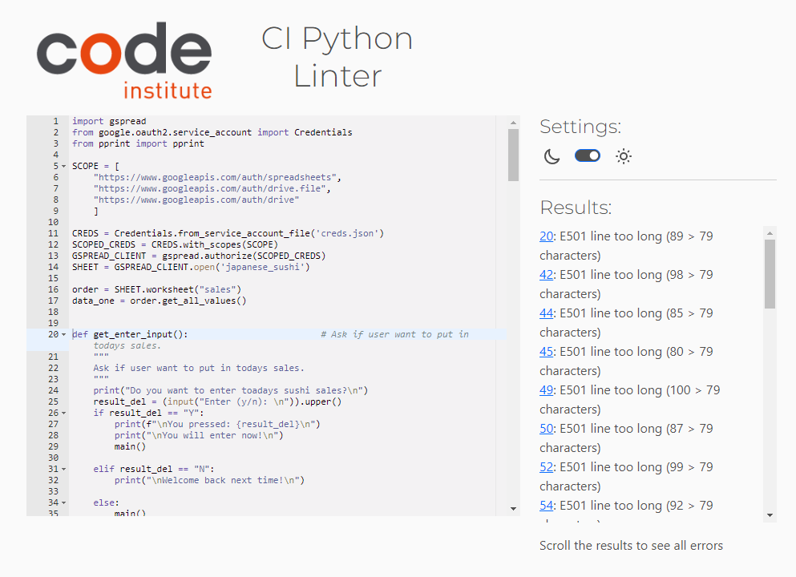

# Sushi bar surplus!

## Table of fontents
***
* [Introduction](#Introduction)
    * [Site goals](#Site-goals)
    * [Target business](#Target-business)
    * [User stories](#User-stories)
    * [Features planned](#Features-planned)
* [Structure](#Structure)
    * [Features](#Features)
* [Flowchart](#Flowchart)
* [Technologies](#Technologies)
* [Testing](#Testing)
    * [PEP8 CI Python Linter - Validator](#PEP8-CI-Python-Linter---Validator)
    * [HTML validator](#HTML-validator)
    * [CSS validator](#CSS-validator)
    * [Manual testing](#Manual-testing)
    * [Bugs and fixes](#Bugs-and-fixes)
* [Deployment](#Deployment)
    * [Version Control](#Version-Control)
    * [Heroku Deployment](#Heroku-Deployment)
    * [Clone Locally](Clone-Locally)
* [Credits](#Credits)
  * [Content](#Content)
* [Acknowledgments](#Acknowledgments)

## Introduction
***
This project was created to get the small sushi bar input in how much they need to premanufacturing till the next day. So the customers doesn't need to wait to get their lunch.

### Site goals

* Simpel program for the user to send input for how much they have sold and get input how much to premanufactur next day. Just to optimize their business.

### Target business

* Let small business get benefits of technologi to optimize their business with a low cost.

### User stories

* As a user, I want a easy way to put in my data and recieve new data for next days.
* As a user, I want to get back if I enter worng sales data to the program.
* As a user, I want to see what I enterd, so I can correct the values that was handled in to the program.
* As a user, I want to like follow how the program is working while I wait for the input to premanufacturing.
* As a user, I want to exit the program in the beginning, if I forgot to take in every data.

### Features planned

* Return profit for todays sale.
* Return wast cost of sushi that din't get sold under lunch time.

## Structure
***
The input for the user is folowing the structure of the flowcart. The flowcart is created my using the Balsamico program. 

### Features

User story
- As a user, I want a easy way to put in my data and recieve new data for next days.

- As a user, I want to get back if I enter worng sales data to the program.

- As a user, I want to see what I enterd, so I can correct the values that was handled in to the program.

- As a user, I want to like follow how the program is working while I wait for the input to premanufacturing.

- As a user, I want to exit the program in the beginning, if I forgot to take in every data.

- Google worksheet to handle all data.
    - [Worksheet](https://docs.google.com/spreadsheets/d/1GaaS7kAsvpr2OhWKtWS60sqKEOCdRK1qJWa1HjPW7Js/edit?usp=sharing)

## Flowchart
***
The Flowchart for my program was created using Balasamiq and it visually represents how the flow system works.

## Technologies
***
* Python - The main language used to build this application
    * Python package:
        * Gspread - To access and creat and delete rows in the google spreadsheet.

## Testing
***
### PEP8 CI Python Linter - Validator
I tested my Python code and there are no errors. There were E501, cause it's comments on the code in the same line.
https://pep8ci.herokuapp.com/

### HTML validator
Not done, cause there is no web-page. The one is through Heroku.

### CSS calidator
Not done, cause there is no web-page. The one is through Heroku.

### Manual testing

| Feature              | Expected outcome                                                                                  | Does it work?  |
| -------------        |:-------------:                                                                                    | -----:|
| Program start        | The program start and ask if you want to enter todays sales.                                         |  Yes  |
| Question (Y/N)       | User can press n or captial N and still exit the program.                                           |  Yes  |
| Question (Y/N)       | User come to next option wher input come, despite what key is pressed.                              |  Yes  |
| Input validation     | User makes correct input with 5 values separetad whit a comma ",".                                  |  Yes  |
| Input validation     | User make to many input whit a comma. User have to make a new input and see what was worng.         |  Yes  |
| Input validation     | User write the input with letter. User have to make a new input and see what was worng.             |  Yes  |
| Input validation     | User make to few input whit a comma. User have to make a new input and see what was worng.         |  Yes  |
| Input validation     | User make whitespace before and/or after the input. User gets correct, whitespace is removed.       |  Yes  |
| Input is corrrect    | Displays what the user have made as input                                                        |  Yes     |
| Input is corrrect    | Displays for the user the porgress of the calculation and updating                                   |   Yes  |
| Input is corrrect    | The spreadsheet of sales is updated correctly                                                    |   Yes  |
| Input is corrrect    | The spreadsheet of surplus is updated correctly                                                    |   Yes  |
| Input is corrrect    | The spreadsheet of remauf is updated correctly                                                    |   Yes  |
| Input is result      | Dispays what suggestion of next day to premanufactur                                                |   Yes  |
| End delete Question  | Dispays a quiestom with (y/n)                                                                      |   Yes  |
| End delete Question  | User press "n" or capital "N"                                                                      |   Yes  |
| End delete Question  | Dispays a thank you when user don't want to delete its input.                                      |   Yes  |
| End delete Question  | User press "Y" or "y" to delete, and shows what letter was enterd                                   |   Yes  |
| End delete Question  | Dispays for the user that the data is deleted                                                        |   Yes  |
| End delete Question  | The speadsheef of the lates data is deleted in sales.                                              |   Yes  |
| End delete Question  | The speadsheef of the lates data is deleted in surplus.                                              |   Yes  |
| End delete Question  | The speadsheef of the lates data is deleted in premanuf.                                              |   Yes  |
| End delete Question  | User gets to the beginning to make correct input after the data is deleted.                           |   Yes  |

### Bugs and fixes

After the worksheet was woriking prefect and after a while the program din't work any more. The worksheet didn't work any more. But after a while, I notis in the worksheet that data was comming in the wrong column. And that was cause I did some notes in the worksheet.

Trying to delet the last row where the last input had come didn't work in the beginning. The lengt of the column whas the hole spreadsheet. It got solved when all rows that was not use was deleted. And adding new rows no problem either.

Bugs that appear along whit the coding was fixed as the progress when on.

## Deployment
***
### Version Control
The site was created using the GitPod web Code editor and pushed to github to the remote repository.

The following git commands were used throughout development to push code to the remote repo:

` git add <file> ` - This command was used to add the file(s) to the staging area before they are committed.
` git commit -m "message" ` - This command was used to commit changes to the local repository queue ready for the final step.
` git push ` - This command was used to push all committed code to the remote repository on github.

### Heroku Deployment
The below steps were followed to deploy this project to Heroku:
* Go to Heroku and click "New" to create a new app.
* Choose an app name and region region, click "Create app".
* Go to "Settings" and navigate to Config Vars. Add the following config variables:
    * PORT : 8000
    * CREDS : Copy your "creds.json"-data
* Navigate to Buildpacks and add buildpacks for Python and NodeJS (in that order).
* Navigate to "Deploy". Set the deployment method to Github and enter repository name and connect.
* Scroll down to Manual Deploy, select "main" branch and click "Deploy Branch".
* The app will now be deployed to heroku

### Clone Locally
Navigate to the GitHub Repository you want to clone to use locally:

Click on the code drop down button
- Click on HTTPS
- Copy the repository link to the clipboard
- Open your IDE of choice (git must be installed for the next steps)
    - ` git clone https://github.com/GroundBuilder/japanese-sushi `
- Type git clone copied-git-url into the IDE terminal

The project will now of been cloned on your local machine for use.

## Credits
***
### Content

- [gspread](https://docs.gspread.org/) find way to get to worksheet data.
- [Code Institute][https://learn.codeinstitute.net/] learn how to code python
- [Love Sandwish][https://learn.codeinstitute.net/] Inspiration of struction and idea of back-end solution.

## Acknowledgments
***
A huge thank you to my mentor Gareth for your help and support that kept me motivated.